# Radhakundah Platform — Backend Architecture

> Complete technical documentation of the backend as built.
> Companion to `agent.md` (the spec). This document describes **what exists in the code**, not what was planned.

**Repository:** `mahavi-official/NikunjaWebBackend`
**Branch:** `feature/radhakundah-backend`
**Status:** Backend complete — 93 endpoints live, build clean, API frozen

---

## Table of contents

1. [What this service is](#1-what-this-service-is)
2. [Technology stack](#2-technology-stack)
3. [System architecture](#3-system-architecture)
4. [Request lifecycle](#4-request-lifecycle)
5. [Folder structure](#5-folder-structure)
6. [Layering rules](#6-layering-rules)
7. [Authentication flows](#7-authentication-flows)
8. [Authorization (RBAC)](#8-authorization-rbac)
9. [Data model](#9-data-model)
10. [Content publishing flow](#10-content-publishing-flow)
11. [Slug changes and redirects](#11-slug-changes-and-redirects)
12. [Research: gated PDF access](#12-research-gated-pdf-access)
13. [Media upload pipeline](#13-media-upload-pipeline)
14. [Full-text search](#14-full-text-search)
15. [SEO pipeline](#15-seo-pipeline)
16. [Response envelope](#16-response-envelope)
17. [Error handling](#17-error-handling)
18. [Background jobs](#18-background-jobs)
19. [Complete API reference](#19-complete-api-reference)
20. [Environment variables](#20-environment-variables)
21. [Running the project](#21-running-the-project)
22. [Verification status](#22-verification-status)
23. [Known gaps](#23-known-gaps)

---

## 1. What this service is

A **stateless REST API** powering the Radhakundah website and CMS — a content hub for research publications, articles, blogs, media galleries, and YouTube videos.

It serves four distinct audiences through four namespaces:

| Namespace | Who calls it | Auth | Cacheable |
|---|---|---|---|
| `/api/v1/public/*` | Next.js SSR/ISR, anonymous visitors | none | yes, CDN-friendly |
| `/api/v1/auth/*` | Sign-in flow | mixed | no |
| `/api/v1/me/*` | Signed-in members and staff | member+ | no |
| `/api/v1/admin/*` | CMS | staff only | no |

**Design constraints held throughout:** no Redis, no queues, no microservices, no GraphQL, no password auth. Google OAuth only.

---

## 2. Technology stack

| Layer | Choice |
|---|---|
| Runtime | Node.js + TypeScript (strict) |
| HTTP framework | Fastify |
| ORM | Prisma 5 |
| Database | PostgreSQL 16 |
| Validation | Zod via `fastify-type-provider-zod` |
| Object storage | AWS S3 — two buckets (public media, private PDFs) |
| Images | `sharp` |
| PDF text | `pdf-parse` |
| Email | Gmail SMTP via `nodemailer` |
| Auth | Google OAuth (`google-auth-library`) + JWT |
| Scheduling | `node-cron`, in-process |
| Docs | `@fastify/swagger` + `@fastify/swagger-ui` at `/docs` |
| Logging | `pino` with request IDs |

---

## 3. System architecture

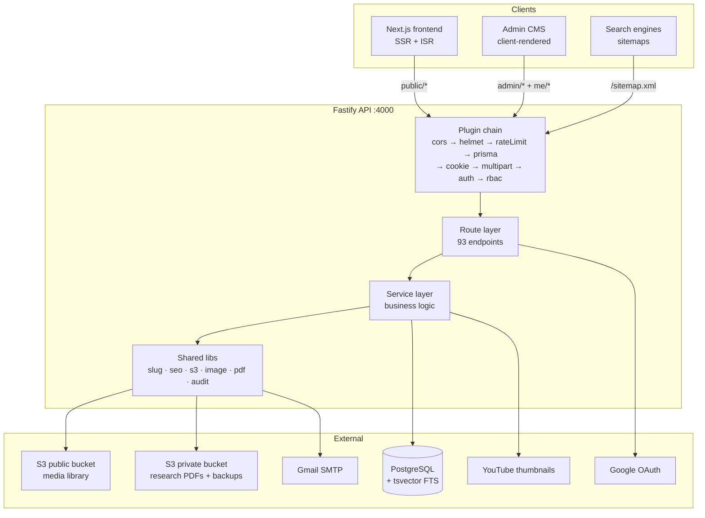

**Key property:** the backend is stateless. Sessions live in Postgres, files in S3. It scales horizontally behind a load balancer with zero code changes.

---

## 4. Request lifecycle

Every request passes through the same chain. The `preHandler` auth hook is where the four namespaces diverge.

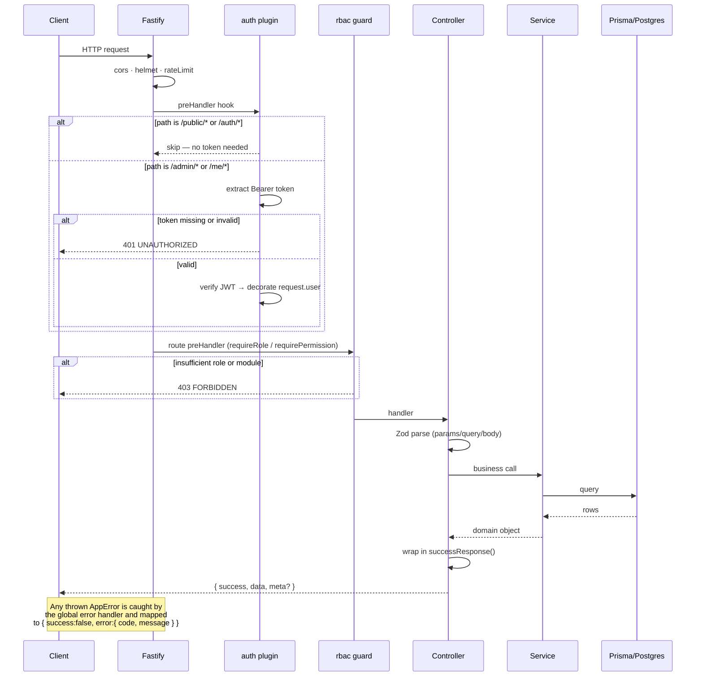

---

## 5. Folder structure

```
src/
├─ server.ts                  # buildApp() — plugin + route registration
├─ index.ts                   # listen, graceful shutdown, cron start
│
├─ config/
│  ├─ env.ts                  # Zod-validated process.env, exits on invalid
│  └─ constants.ts            # roles, statuses, rate limits, HTTP codes
│
├─ plugins/                   # all fastify-plugin wrapped
│  ├─ cors.ts                 # origin allowlist from env
│  ├─ helmet.ts               # HSTS, frame-deny, CSP
│  ├─ rateLimit.ts            # 100/min global per IP
│  ├─ logger.ts               # pino + request IDs
│  ├─ errorHandler.ts         # AppError / Zod / Prisma → envelope
│  ├─ prisma.ts               # PrismaClient injection
│  ├─ auth.ts                 # JWT verify → request.user
│  └─ rbac.ts                 # requireRole() / requirePermission()
│
├─ modules/                   # each: .routes .controller .service .schema
│  ├─ auth/                   # Google OAuth, refresh rotation, logout
│  ├─ users/                  # staff + members, whitelisting, sessions, me
│  ├─ media/                  # upload, derivatives, library
│  ├─ categories/             # scoped ARTICLE | BLOG | RESEARCH
│  ├─ tags/                   # shared across posts + research
│  ├─ posts/                  # articles + blogs (one model, placement field)
│  ├─ authors/                # paper authors, separate from User
│  ├─ research/               # CRUD, private PDFs, gated view URLs
│  ├─ gallery/                # segments + images
│  ├─ videos/                 # YouTube-only + video categories
│  ├─ engagement/             # likes, comments
│  ├─ pages/                  # About singleton
│  ├─ hero/                   # homepage slides
│  ├─ settings/               # site-wide key/value
│  ├─ contact/                # form + honeypot + CSV export
│  ├─ newsletter/             # subscribe / unsubscribe / export
│  ├─ search/                 # Postgres FTS
│  ├─ seo/                    # sitemaps, redirects, preview tokens
│  ├─ dashboard/              # CMS stats + audit logs
│  └─ home/                   # aggregated homepage payload
│
├─ lib/
│  ├─ errors.ts               # AppError + 6 typed subclasses
│  ├─ response.ts             # successResponse, paginationMeta
│  ├─ pagination.ts
│  ├─ jwt.ts                  # access token, refresh token, SHA-256 hashing
│  ├─ oauth.ts                # Google consent URL, code exchange, profile
│  ├─ slug.ts                 # slugify + uniqueness + redirect-on-change
│  ├─ sanitize.ts             # rich-text HTML allowlist
│  ├─ s3.ts                   # upload, presign, delete, key generation
│  ├─ image.ts                # sharp derivatives (4 sizes × webp/original)
│  ├─ pdf.ts                  # text extraction for search
│  ├─ mailer.ts               # SMTP + contact notification
│  ├─ audit.ts                # audit log helpers
│  └─ seo.ts                  # buildSeo() + JSON-LD builders
│
├─ jobs/
│  ├─ backup.ts               # pg_dump → gzip → S3, every 3 days
│  └─ pruneAuditLogs.ts       # weekly, 12-month retention
│
└─ types/                     # ambient .d.ts for nodemailer, pdf-parse

prisma/
├─ schema.prisma              # 20+ models
├─ migrations/
│  ├─ 20260811164951_init/
│  ├─ 20260811164952_add_post_search_vector/
│  └─ 20260811164953_add_research_search_vector/
└─ seed.ts                    # super admin, default categories, settings
```

**Rule:** every module folder is exactly four files. No deeper nesting.

---

## 6. Layering rules

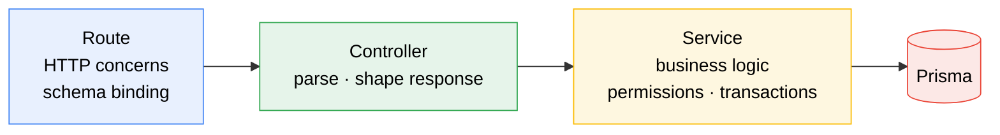

Strictly one direction. Two rules that matter:

- **Routes and controllers never touch Prisma directly.**
- **Services never touch `request` or `reply`.**

Services receive a `PrismaClient` as their first argument, which keeps them trivially testable and free of Fastify coupling.

---

## 7. Authentication flows

**There are no passwords anywhere in this system.** Everyone signs in with Google.

### 7.1 Sign-in and whitelisting

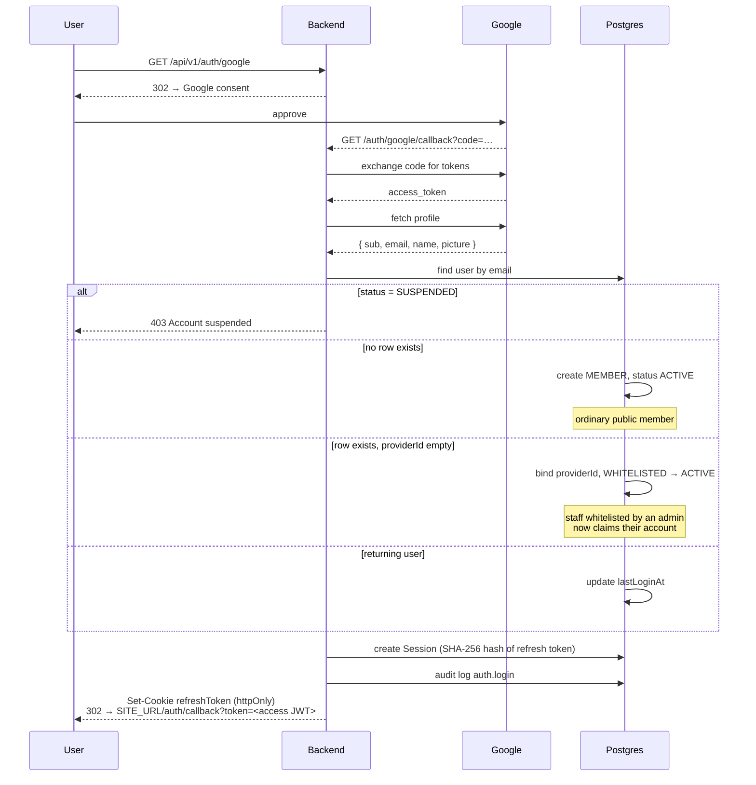

**Whitelisting replaces invite tokens entirely.** An admin inserts a `User` row with an email, role, and `status = WHITELISTED`. No token, no email link. When that person signs in with Google and the email matches, they are bound and activated.

### 7.2 Token model

| Token | Type | TTL | Storage | Transport |
|---|---|---|---|---|
| Access | JWT `{ sub, role, editorModules }` | 15 min | not stored | `Authorization: Bearer` |
| Refresh | 32 random bytes, opaque | 30 days | **SHA-256 hash** in `Session` | httpOnly cookie, `Path=/api/v1/auth` |

### 7.3 Refresh rotation

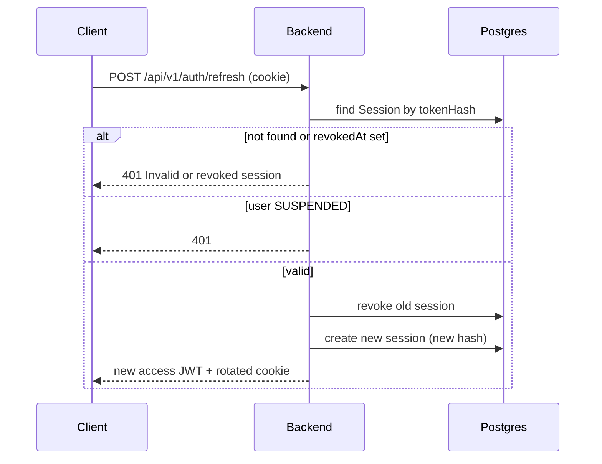

Every refresh rotates. The old session row is marked `revokedAt` rather than deleted, which preserves the audit trail.

**Logout** revokes one session. **Logout-all** revokes every session for the user — this satisfies the client's "Session Management" requirement directly.

---

## 8. Authorization (RBAC)

Roles are **hardcoded in `src/plugins/rbac.ts`**, not stored as editable permission rows. There is no permissions-management UI. This is ~80 lines instead of several tables and a screen.

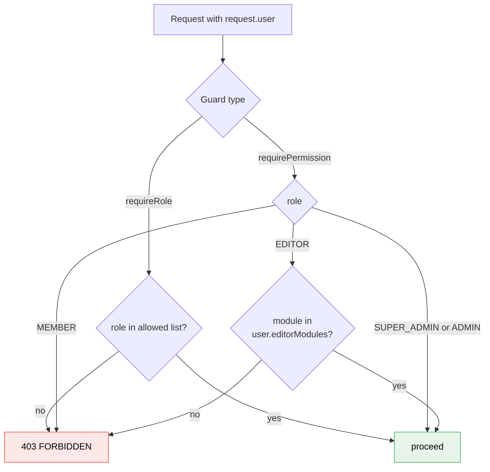

### Capability matrix

| Capability | SUPER_ADMIN | ADMIN | EDITOR | MEMBER |
|---|:--:|:--:|:--:|:--:|
| Content CRUD + publish | ✓ | ✓ | ✓ within `editorModules` | — |
| Media library | ✓ | ✓ | upload | — |
| Manage users / whitelist | ✓ | ✓ | — | — |
| Site settings, redirects | ✓ | — | — | — |
| Audit logs | ✓ | ✓ | — | — |
| Like / comment / view PDFs | ✓ | ✓ | ✓ | ✓ |

`editorModules` is a string array such as `["posts","research","gallery","videos"]`.

### Super-admin protection

Enforced in **one place** — `users.service.ts` — not scattered across routes:

```
any update / role change / suspend / delete
  targeting a user with isProtected = true
    → rejected unless the actor is that same user
```

The super admin is seeded from `SUPER_ADMIN_EMAIL` at first boot with `isProtected = true`. That account can never be deleted, demoted, or suspended by anyone.

---

## 9. Data model

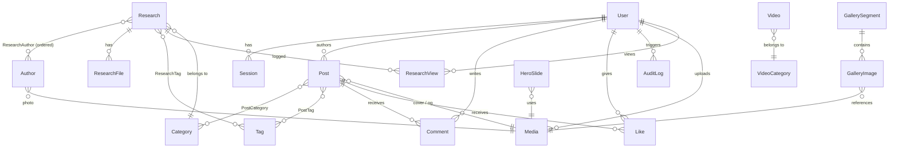

### Core entities

| Model | Purpose | Notable fields |
|---|---|---|
| `User` | staff **and** members in one table | `role`, `status`, `isProtected`, `editorModules`, `providerId` |
| `Session` | refresh-token store, enables real revocation | `tokenHash` (SHA-256), `revokedAt` |
| `Post` | articles **and** blogs, one model | `placement` (ARTICLE/BLOG/BOTH), globally unique `slug`, `searchVector` |
| `Research` | papers; the PDF is the body | `abstract`, `extractedText` (never returned), `searchVector` |
| `ResearchFile` | lives in **private** S3, never public | `s3Key`, `pageCount` |
| `ResearchView` | audit trail of who opened which paper | `userId`, `fileId`, `ip` |
| `Author` | paper author, **not** a User | own indexable page at `/authors/{slug}` |
| `Media` | public bucket + CDN | `variants` JSON: 4 sizes × webp/original |
| `UrlRedirect` | 301 map for slug changes and BOTH posts | `isAuto` flag protects manual rules |
| `AuditLog` | every write + every auth event | 12-month retention, pruned weekly |

### Cascade policy

- **`Restrict`** where an image is structural (gallery images, hero slides) — deleting media cannot silently blank a gallery.
- **`SetNull`** where it is decorative (post covers, OG images).

### Raw SQL (the only raw SQL in the project)

Two hand-written migrations maintain the `tsvector` columns Prisma cannot generate:

| Migration | What it creates |
|---|---|
| `20260811164952_add_post_search_vector` | trigger fn + trigger on `Post`, GIN index |
| `20260811164953_add_research_search_vector` | trigger fn + trigger on `Research`, GIN index |

Both verified live in Postgres.

---

## 10. Content publishing flow

Articles and Blogs share **one `Post` model** separated by `placement`.

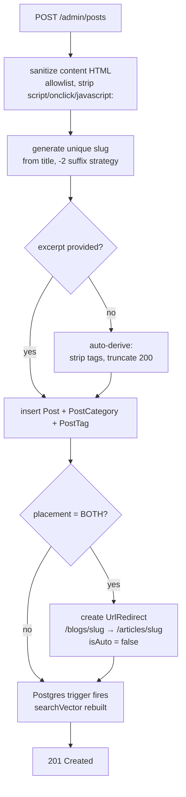

### Placement and canonical URLs

| `placement` | Appears in | Canonical URL | `/blogs/{slug}` behaviour |
|---|---|---|---|
| `ARTICLE` | articles listing | `/articles/{slug}` | n/a |
| `BLOG` | blogs listing | `/blogs/{slug}` | is the canonical |
| `BOTH` | **both** listings | `/articles/{slug}` | **301 →** `/articles/{slug}` |

A `BOTH` post appears in both listings but **every link points at its single canonical URL**. No duplicate content is ever generated.

### Draft, publish, schedule

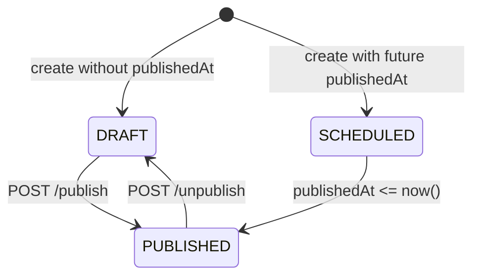

**Scheduled publishing needs no cron job.** Public queries simply filter:

```sql
status = 'PUBLISHED' AND "publishedAt" <= NOW()
```

There is no approval workflow and no revision history — the audit log is the record of change.

---

## 11. Slug changes and redirects

The single most commonly forgotten piece of CMS SEO, handled explicitly.

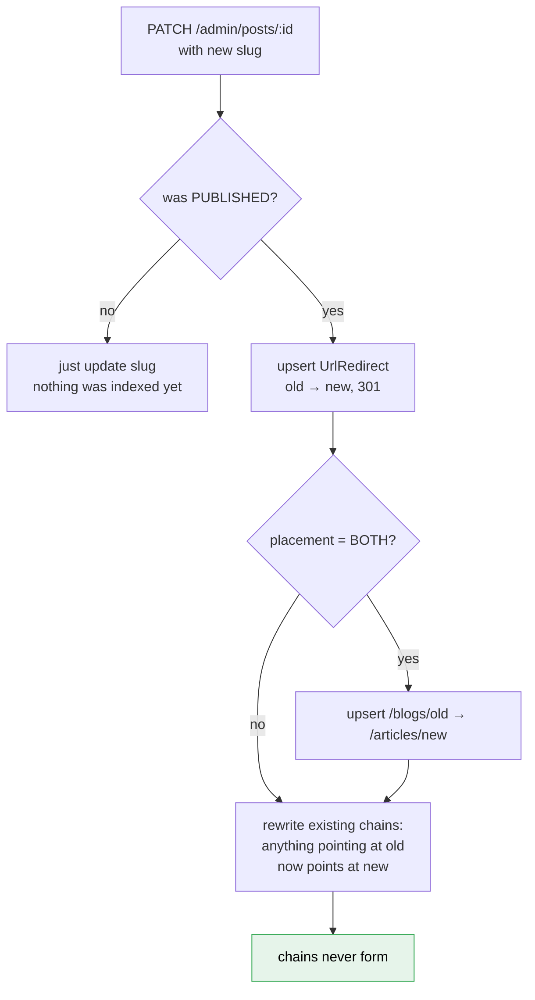

Next.js middleware queries `GET /api/v1/public/redirects?path=…` on a 404 and issues a real 301. This preserves link equity across renames.

---

## 12. Research: gated PDF access

Research PDFs live in the **private** S3 bucket with all public access blocked at the bucket policy level. They never have a public URL.

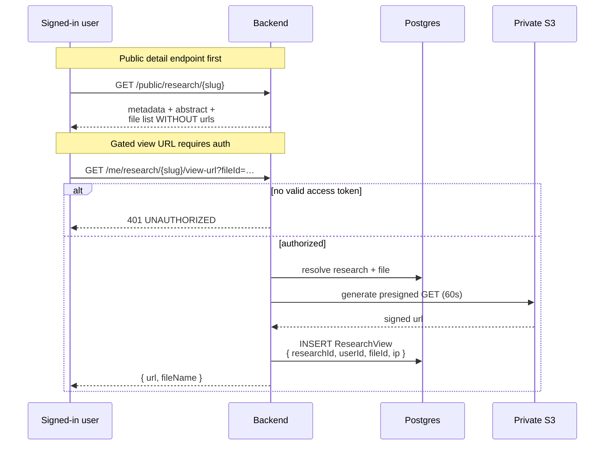

### The accepted limitation (client agreed)

"View but not download" is **not technically enforceable** — anything a browser renders can be saved. What is delivered:

- private bucket, public access blocked at **policy** level
- no public URL ever issued
- **60-second** presigned URLs, only to signed-in users
- inline PDF.js viewer with the download/print toolbar removed (frontend)
- `Content-Disposition: inline`, right-click disabled (frontend)

This stops casual downloading, not a determined user. **Every access is recorded in `ResearchView`** — the gating is only meaningful because it is auditable.

### PDF text extraction

On upload, `pdf-parse` extracts text into `Research.extractedText`. That column feeds the search index at weight C and is **never returned to clients** — controllers strip it explicitly.

---

## 13. Media upload pipeline

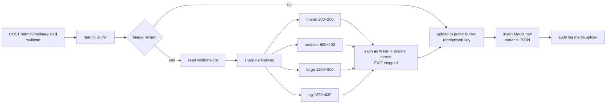

Derivatives are generated **at upload**, not per request. This serves the client's "optimized images" and fast-loading requirements far better than on-the-fly transformation, and lets a CDN cache everything immutably.

**Limits:** images 10 MB, PDFs 50 MB. S3 keys are randomised (`timestamp-random.ext`).

---

## 14. Full-text search

PostgreSQL FTS — no Meilisearch, no Typesense.

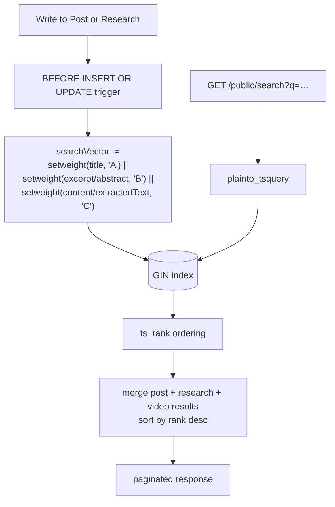

| Field | Weight |
|---|---|
| Title | A |
| Excerpt / abstract | B |
| Body content / extracted PDF text | C |

Vectors are **computed on write**, so reads are index-only and the server is never strained. Videos are matched with `ILIKE` since they have no vector column.

Search is rate-limited to 30 requests/minute per IP.

---

## 15. SEO pipeline

**Principle: the backend is the single source of SEO truth.** Next.js renders what the API tells it and never invents metadata or runs fallback logic.

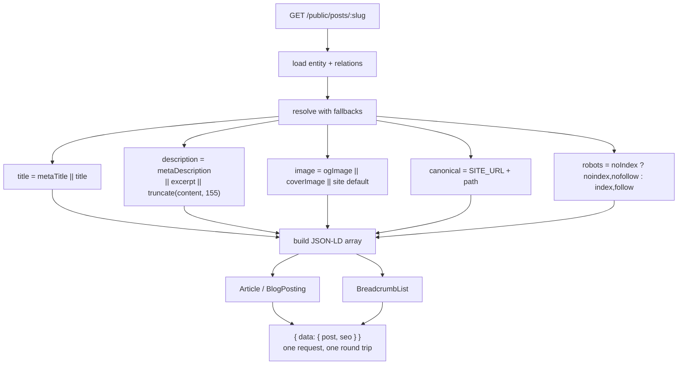

### JSON-LD by entity

| Type | Where |
|---|---|
| `Article` | posts |
| `ScholarlyArticle` | research — `author[]`, `datePublished`, DOI, journal |
| `VideoObject` | videos — `embedUrl`, `thumbnailUrl`, `duration` |
| `ImageGallery` | gallery segments |
| `Person` | authors |
| `BreadcrumbList` | all detail pages |

### Sitemaps

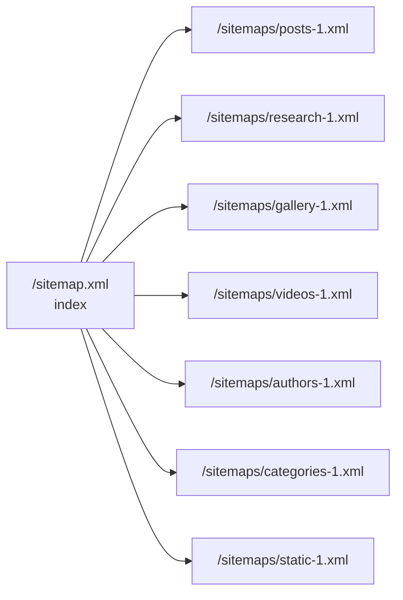

Paginated at **5,000 URLs per file**. `lastmod` comes from `updatedAt`. Unpublished, `noIndex`, and future-dated items are excluded. Cached 1 hour.

---

## 16. Response envelope

**Every** response, success or failure, uses one shape.

**Success:**

```jsonc
{
  "success": true,
  "data": { /* ... */ },
  "meta": { "page": 1, "limit": 20, "total": 84, "totalPages": 5 }
}
```

`meta` is omitted on non-paginated responses.

**Failure:**

```jsonc
{
  "success": false,
  "error": {
    "code": "VALIDATION_FAILED",
    "message": "Human-readable message",
    "details": [{ "field": "email", "message": "Invalid email" }]
  }
}
```

`error.code` is a **stable enum** the frontend switches on. Pagination is offset-based (`?page=&limit=`).

Built by `successResponse()` and `paginationMeta()` in `src/lib/response.ts`.

---

## 17. Error handling

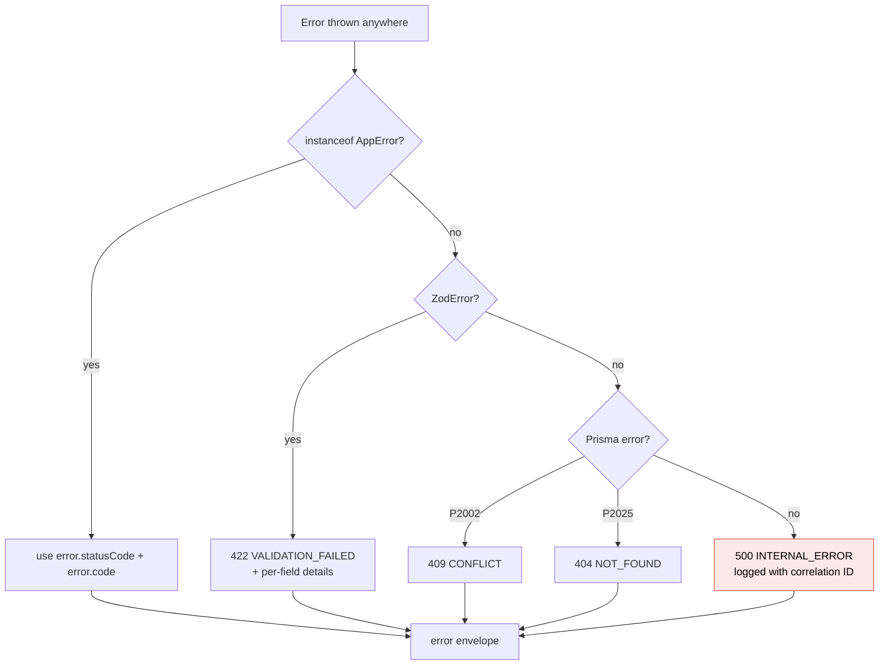

### Error classes (`src/lib/errors.ts`)

| Class | Status | Code |
|---|---|---|
| `NotFoundError` | 404 | `NOT_FOUND` |
| `UnauthorizedError` | 401 | `UNAUTHORIZED` |
| `ForbiddenError` | 403 | `FORBIDDEN` |
| `ConflictError` | 409 | `CONFLICT` |
| `ValidationFailedError` | 422 | `VALIDATION_FAILED` |
| `RateLimitError` | 429 | `RATE_LIMITED` |

**Stack traces never leave the server in production.** In development the raw message is surfaced; in production the client gets a generic message and the detail goes to the log with a correlation ID.

---

## 18. Background jobs

Two `node-cron` jobs, in-process, no queue system. Started in `src/index.ts` after Fastify boots.

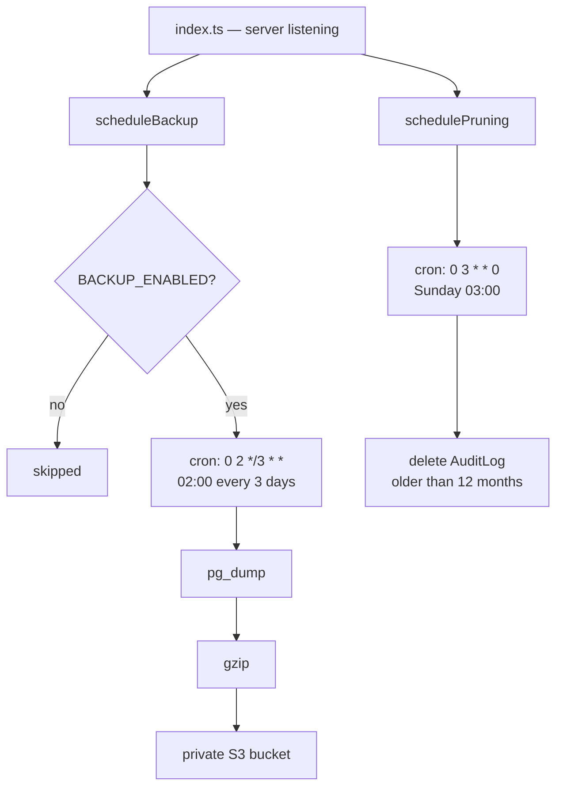

| Job | Schedule | What it does |
|---|---|---|
| `backup.ts` | every 3 days, 02:00 | `pg_dump` → gzip → private S3, 90-day retention |
| `pruneAuditLogs.ts` | weekly, Sunday 03:00 | deletes audit rows older than 12 months |

**Database dump only** — media already lives in S3.

> An untested backup is not a backup. The restore procedure must be documented and tested before launch.

---

## 19. Complete API reference

**93 endpoints.** Interactive docs at `http://localhost:4000/docs`.

### Public — no auth, CDN-cacheable

| Method | Path | Purpose |
|---|---|---|
| GET | `/api/v1/public/home` | hero, featured, latest, recent updates — one payload |
| GET | `/api/v1/public/posts` | `?placement=&category=&tag=&q=&page=` |
| GET | `/api/v1/public/posts/:slug` | detail + resolved `seo` + JSON-LD |
| POST | `/api/v1/public/posts/:slug/view` | fire-and-forget view increment |
| GET | `/api/v1/public/research` | `?category=&author=&year=&q=&page=` |
| GET | `/api/v1/public/research/:slug` | metadata + abstract, **file list without urls** |
| GET | `/api/v1/public/authors` | list |
| GET | `/api/v1/public/authors/:slug` | detail + publications |
| GET | `/api/v1/public/gallery` | segments with cover + description |
| GET | `/api/v1/public/gallery/:slug` | images |
| GET | `/api/v1/public/videos` | list |
| GET | `/api/v1/public/videos/:slug` | detail + `VideoObject` |
| POST | `/api/v1/public/videos/:slug/view` | view increment |
| GET | `/api/v1/public/categories` | `?scope=ARTICLE\|BLOG\|RESEARCH` |
| GET | `/api/v1/public/video-categories` | list |
| GET | `/api/v1/public/tags` | list |
| GET | `/api/v1/public/hero` | active slides |
| GET | `/api/v1/public/pages/:key` | About etc. |
| GET | `/api/v1/public/settings` | site title, logo, socials, GA id |
| GET | `/api/v1/public/search` | `?q=&type=&page=` — rate-limited 30/min |
| GET | `/api/v1/public/comments` | `?postId=&page=` |
| POST | `/api/v1/public/contact` | honeypot + **3/hour** |
| POST | `/api/v1/public/newsletter/subscribe` | **3/hour** |
| GET | `/api/v1/public/newsletter/unsubscribe/:token` | single-click opt-out |
| GET | `/api/v1/public/redirects` | `?path=` — Next middleware 404 lookup |

### SEO (XML, served at root)

| Method | Path |
|---|---|
| GET | `/sitemap.xml` |
| GET | `/sitemaps/:type-:page.xml` |

### Auth

| Method | Path | Purpose |
|---|---|---|
| GET | `/api/v1/auth/google` | redirect to Google consent |
| GET | `/api/v1/auth/google/callback` | exchange, whitelist match, issue tokens |
| POST | `/api/v1/auth/refresh` | rotate refresh cookie |
| POST | `/api/v1/auth/logout` | revoke this session |
| POST | `/api/v1/auth/logout-all` | revoke every session |

### Me — authenticated members and above

| Method | Path |
|---|---|
| GET / PATCH | `/api/v1/me` |
| GET | `/api/v1/me/sessions` |
| DELETE | `/api/v1/me/sessions/:id` |
| GET | `/api/v1/me/research/:slug/view-url` |
| POST / DELETE | `/api/v1/me/posts/:id/like` |
| POST | `/api/v1/me/comments` |
| PATCH / DELETE | `/api/v1/me/comments/:id` |

### Admin — staff only

Uniform CRUD so the shape is learnable once:

```
GET | POST            /api/v1/admin/{resource}
GET | PATCH | DELETE  /api/v1/admin/{resource}/:id
```

Resources: `posts`, `research`, `authors`, `videos`, `video-categories`, `gallery`, `categories`, `tags`, `media`, `hero`, `users`, `pages`, `redirects`.

**Actions beyond CRUD:**

| Method | Path | Purpose |
|---|---|---|
| POST | `/admin/posts/:id/publish` · `/unpublish` | status transitions |
| POST | `/admin/posts/:id/preview-token` | 30-min draft-mode token |
| POST | `/admin/research/:id/publish` · `/unpublish` | status transitions |
| POST | `/admin/research/:id/files` | PDF upload → private bucket |
| DELETE | `/admin/research/files/:fileId` | remove file |
| POST | `/admin/videos/:id/publish` · `/unpublish` | status transitions |
| POST | `/admin/gallery/:id/images` | multi-image add |
| POST | `/admin/gallery/:id/reorder` | `[{ id, order }]` |
| DELETE | `/admin/gallery/images/:imageId` | remove image |
| POST | `/admin/media/upload` | multipart |
| POST | `/admin/users/:id/suspend` · `/activate` | account state |
| POST | `/admin/comments/:id/hide` | moderation |
| GET | `/admin/contact-messages` | inbox |
| PATCH | `/admin/contact-messages/:id/read` | mark read |
| GET | `/admin/contact-messages/export.csv` | CSV export |
| GET | `/admin/newsletter` · `/export.csv` | subscribers |
| GET | `/admin/dashboard/stats` | the 8 counts from the client spec |
| GET | `/admin/dashboard/activity` | recent activity feed |
| GET | `/admin/audit-logs` | filterable |
| GET / PATCH | `/admin/settings` | **SUPER_ADMIN only** |

### Health

| Method | Path | Purpose |
|---|---|---|
| GET | `/health` | liveness |
| GET | `/health/ready` | readiness — DB reachable |

---

## 20. Environment variables

Validated by Zod at boot in `src/config/env.ts`. **The process refuses to start if a required variable is missing.**

```bash
NODE_ENV=production
PORT=4000
API_URL=https://api.radhakundah.com
SITE_URL=https://radhakundah.com          # canonical, used in all SEO output
CORS_ORIGINS=https://radhakundah.com

DATABASE_URL=postgresql://...

JWT_ACCESS_SECRET=
JWT_ACCESS_TTL=15m
REFRESH_TOKEN_TTL_DAYS=30
COOKIE_DOMAIN=.radhakundah.com
COOKIE_SECURE=true

GOOGLE_CLIENT_ID=
GOOGLE_CLIENT_SECRET=
GOOGLE_CALLBACK_URL=https://api.radhakundah.com/api/v1/auth/google/callback

SUPER_ADMIN_EMAIL=                        # seeded once, protected forever
SUPER_ADMIN_NAME=

SMTP_HOST=smtp.gmail.com
SMTP_PORT=587
SMTP_USER=
SMTP_PASS=                                # Gmail App Password (requires 2FA)
MAIL_FROM="Radhakundah <no-reply@radhakundah.com>"
CONTACT_NOTIFY_TO=

S3_REGION=
S3_BUCKET_PUBLIC=                         # media library
S3_BUCKET_PRIVATE=                        # research PDFs — block ALL public access
S3_ACCESS_KEY_ID=
S3_SECRET_ACCESS_KEY=
S3_PUBLIC_BASE_URL=                       # CDN in front of the public bucket
SIGNED_URL_TTL_SECONDS=60

BACKUP_ENABLED=true
BACKUP_CRON="0 2 */3 * *"
BACKUP_S3_BUCKET=
BACKUP_RETENTION_DAYS=90

RECAPTCHA_SECRET=                         # optional; captcha inert if empty
PREVIEW_TOKEN_TTL_MINUTES=30
LOG_LEVEL=info
```

---

## 21. Running the project

### First-time setup

```bash
npm install

# start Postgres
docker compose up -d postgres

# generate client + apply all 3 migrations
npm run db:generate
npm run db:migrate

# seed super admin, default categories, settings
npm run db:seed
```

### Development

```bash
npm run dev          # tsx watch → http://localhost:4000
npm run build        # tsc — must pass clean
```

### Verify it works

```bash
curl http://localhost:4000/health
curl http://localhost:4000/api/v1/public/categories?scope=ARTICLE
curl http://localhost:4000/sitemap.xml
open http://localhost:4000/docs          # Swagger UI, all 93 endpoints
```

### Production notes

- **Prisma migrations run as an explicit deploy step, never auto-applied at boot.**
- TLS everywhere, HSTS with preload.
- Private S3 bucket blocked at the **bucket policy** level, not just object ACLs.
- Least-privilege IAM — separate credentials for media, private files, and backups.

---

## 22. Verification status

| Check | Result |
|---|---|
| `npm run build` (tsc strict) | ✅ clean |
| Server boots | ✅ |
| Swagger endpoint count | ✅ **93 paths** (was 3) |
| `/health` | ✅ 200 |
| `/api/v1/public/categories` | ✅ 200, correct envelope + meta |
| `/api/v1/admin/posts` without token | ✅ **401** |
| `/sitemap.xml` | ✅ valid XML index |
| `/api/v1/public/search` | ✅ 200 |
| Migrations applied | ✅ 3 of 3, schema in sync |
| Postgres triggers live | ✅ `update_post_search_vector_trigger`, `update_research_search_vector_trigger` |
| GIN indexes live | ✅ `idx_post_search_vector`, `idx_research_search_vector` |

---

## 23. Known gaps

Honest list of what is **not** done.

| Gap | Impact | Notes |
|---|---|---|
| **ESLint has no config file** | `npm run lint` fails outright | Pre-existing, unrelated to this work. Run `npm init @eslint/config`. |
| **No automated tests** | no regression safety net | `vitest` + `supertest` are in devDependencies but unused. |
| **`src/emails/` not created** | none today | The only transactional email (contact notification) is inline in `mailer.ts`. A template directory for one email would be over-engineering per §0 of `agent.md`. Split it out when a second email appears. |
| **reCAPTCHA escalation not wired** | contact form relies on honeypot + 3/hr limit | `RECAPTCHA_SECRET` is read but the verification call is not implemented. Spec says captcha stays inert until configured — implement when spam appears. |
| **Backup restore never tested** | ⚠️ **highest-risk item** | The backup job writes to S3, but no restore has been performed. *An untested backup is not a backup.* Do this before launch. |
| **Response schemas not declared on routes** | slower serialization; no structural leak guard | Fastify can serialize faster with declared response schemas, and they structurally prevent leaking internal fields. Controllers currently strip sensitive fields (`content` on lists, `extractedText` on research) by hand. |
| **Editor "own content only" delete** | editors can delete any content in their modules | Spec §3.9 says editors delete *own only*. `requirePermission` checks module access but not ownership. |

### Assumptions still requiring confirmation (`agent.md` §17)

1. **Staff authenticate with Google OAuth too** — no password fallback exists. Cheap to change now, painful once there is data.
2. Canonical domain is `radhakundah.com`, API at `api.radhakundah.com`, cookie scoped to `.radhakundah.com`.
3. Comment moderation defaults to publish-immediately with admin hide/delete.
4. Member sign-up is open — any Google account becomes a `MEMBER`.
5. `BOTH` posts get one live URL with `/blogs/{slug}` 301-redirecting.
6. Gmail SMTP is transactional only — it cannot send newsletters (~500/day cap).

---

## Next steps

1. **Test the backup restore procedure** — the single highest-risk open item.
2. Set up ESLint config so `npm run lint` runs.
3. Add integration tests for the auth flow and the gated research endpoint.
4. Build the Next.js frontend against this API — **the public API is frozen.**
5. Before launch: `EXPLAIN ANALYZE` on listing queries, Lighthouse + Rich Results validation, rate-limit tuning.
